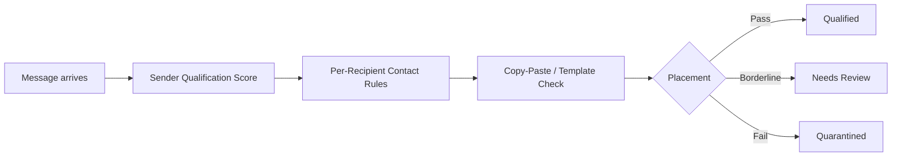
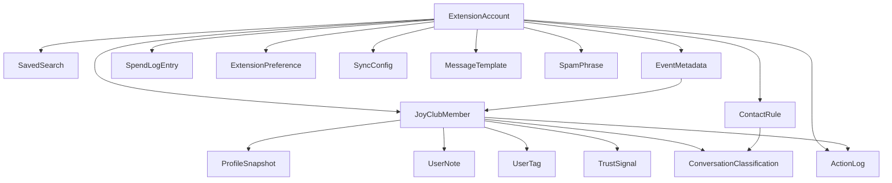
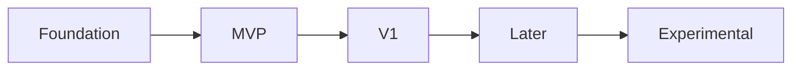

# JoyClub Enhancement Extension: Product Requirements Document

2026-09-22 · @Someone

## 1. Executive Summary

**Product concept.** A Firefox browser extension that enhances the existing JoyClub.de and JOYCE experience for a logged-in member. It adds missing controls, local organization and safety tooling directly inside JoyClub's own pages. It does not replace JoyClub. It does not require JoyClub's cooperation, API access or any change to JoyClub's own product.

**Primary value proposition.** The project's own research (`platform-review-research.md`, `joyclub-product-teardown.md`) identifies two problems with the strongest, most cross-corroborated evidence: uncontrolled first-contact volume with no quality gate (MSG-001, High confidence) and a total absence of any peer reputation, trust signal or personal-notes layer between members (teardown Sections 6 and 14, confirmed gap). This extension answers both, entirely client-side, without building or operating a second platform.

**How this differs from the standalone-platform work already in this project.** `swinger-bdsm-platform-spec.md` and `audience-contact-eligibility-spec.md` assume you control the server and can block a message before it is composed. An extension cannot do that on someone else's platform. Every "prevent before it happens" feature in those docs downgrades here to "detect, triage and control after it arrives." That translation runs through this entire document and is made explicit in Section 5.

**Initial scope.** Personal tool for one account first. Architected from day one for open-source, public release, distributed primarily through Firefox Add-ons (AMO) with a self-distributed build also available. Desktop Firefox only. Multi-account and couple dual-login supported in the data model from the start.

**What this is not.**

- Not a replacement for JoyClub and not a competing platform.
- Not an automation tool. It reads what a normal page load already renders and never calls undocumented JoyClub endpoints.
- Not a way to bypass verification, payment, moderation or access controls.
- Not a bulk data collection tool. Notes and cached profile data stay device-local unless the user explicitly enables encrypted, self-hosted sync.

## 2. Problem Definition

Every problem below traces to a specific project document. Confidence and severity ratings are carried over from the source research, not re-assessed here.

| Problem | Evidence | Confidence | Extension-relevant |
| --- | --- | --- | --- |
| No message-quality gate; extreme volume asymmetry (one documented case: 17 vs 2,894 messages a month) | platform-review-research.md MSG-001, Section 3.1 | High | Yes |
| Message-block bypass via the Like mechanic | platform-review-research.md MSG-002, Section 3.1 | Medium | Partially |
| No pre-send contact eligibility by profile type, completeness, verification or reputation | audience-contact-eligibility-spec.md; platform-competitor-analysis.md Section 5 | Planned feature, not an observed complaint | Partially, recipient-side only |
| No peer reputation or trust-signal system between members | joyclub-product-teardown.md Sections 6, 8, 14 | High, confirmed absent | Yes, local approximation |
| No saved searches; compatibility signal limited to raw filters | joyclub-product-teardown.md Sections 2.3, 7 | Medium | Yes |
| Fake or duplicate profile increase reported since roughly 2020 | platform-review-research.md Section 3.1 | Low-Medium | Partially, local scoring only |
| Inconsistent, sometimes punitive moderation; suppressed criticism | platform-review-research.md Sections 1, 3.1 (MOD-001) | Medium, high severity | No, a governance problem |
| Reported bad actors stay active while the reporter is ignored or sanctioned | platform-review-research.md MOD-002 | Medium-High, cross-corroborated on a second platform | No, needs JoyClub cooperation |
| Watermark and content-leak exposure (de-watermarked in under 30 seconds with a free tool) | platform-review-research.md Sections 1, 3.1 | Medium | Partial, local viewer warning only |
| Opaque, undocumented organizer tooling | joyclub-product-teardown.md Sections 2.8, 14 | Confirmed gap, no public data | No for organizer tools themselves; yes for personal event tracking |
| Mobile/desktop feature parity gap | joyclub-product-teardown.md Section 2.14 | High, first-party confirmed | Out of scope, this extension targets desktop Firefox only |
| App price roughly 2x the web price for the same tier | platform-review-research.md BIZ-001 | High | No, a business-model problem |
| Confusing multi-tier membership plus a separate Coins economy | platform-review-research.md BIZ-003 | Medium | No |
| Server reliability, crashes reported in App Store reviews | platform-review-research.md Section 3.1 | Medium | No, an infrastructure problem |
| No group chat, separate from the existing 50-person group chat cap | swinger-bdsm-platform-spec.md Section 1.1 | Founder's own direct experience | No, needs JoyClub cooperation |

Rows marked "No" are real problems but sit outside what a client-side extension can fix. They are carried into Section 18 as risks and limits, not attempted as features.

## 3. Product Principles

Nine principles govern every feature decision in this document. A feature that conflicts with one of these needs a written exception, not a silent override.

1. **Local-first privacy.** Personal data about the user and about other members processes and stores on-device by default. Nothing leaves the browser unless the user explicitly turns on sync.
2. **Progressive enhancement, not a second app.** Controls sit inside JoyClub's existing pages, beside the element they relate to. No floating panels or a parallel UI the user has to learn separately.
3. **DOM-only.** The extension reads what a normal, user-triggered page load already renders. It does not call undocumented JoyClub endpoints, even ones the logged-in browser could technically reach.
4. **Confirm before any write.** Anything that sends data to JoyClub's servers (a message, a like, a report, a block, a settings change) requires an explicit user click, every time. One documented exception: Quick Ignore and Delete (Section 6.1) treats a single click as authorizing its whole two-step sequence, block then delete, a deliberate choice recorded in Section 18.4, not a precedent for combining other write actions without asking first.
5. **Low-risk local actions may run automatically.** Tagging, scoring, collapsing or classifying content already on the page can happen without a prompt, because it is reversible, local and invisible to JoyClub.
6. **Encrypt before it leaves the device.** When sync is on, the extension encrypts client-side first. A self-hosted sync target is treated as untrusted storage, never a party that sees plaintext.
7. **Multi-account and couple-aware from day one.** The data model scopes every stored record to an account identity. Retrofitting this later would mean a full schema migration.
8. **Built for review from the start.** Even before any public release, the code follows Mozilla's listed-extension policy (no remote code execution, minimum permissions, no obfuscation) so the eventual AMO submission is not a rewrite.
9. **Graceful degradation.** When JoyClub changes its markup, the affected feature turns itself off cleanly rather than breaking the page or silently misreading data.

## 4. Users and Primary Jobs

Personas reuse the ones already defined in `swinger-bdsm-platform-spec.md` Section 2, translated from "platform member" to "extension user."

| Persona | Who | Primary jobs to be done |
| --- | --- | --- |
| Individual member (you, today) | Single JoyClub account, personal use | Stop wasting time on low-quality first messages. See who is worth replying to at a glance. Keep private notes on people met or messaged, without JoyClub seeing them. |
| Couple, dual login | Two logins tied to one JoyClub profile | Both partners need their own local notes and rules without overwriting each other. See the same trust signals regardless of who is logged in. |
| Event-goer | Any member browsing the event calendar or Swinger-Bereich | Track which events are worth attending. Keep private notes on an event or a venue across visits, since JoyClub has no built-in way to do this. |
| Future public user (post-open-source) | Anyone who installs the extension after public release | Get the same functionality without needing your specific setup knowledge. Understand what data the extension touches before turning on anything sensitive. Trust that a community-maintained tool will not get their account banned. |
| Low-effort sender (anti-persona) | Someone whose messages should get filtered out | Not directly served. The message-triage system in Section 7 is built against this persona, mirroring the anti-persona already defined in the platform spec. |

The extension has exactly one full-time actor: the logged-in member using it. There is no moderator, admin or support-staff role, because the extension has no authority over anyone's account but the installing user's own.

## 5. Extension Opportunity Map

The pattern that repeats across almost every row: the standalone platform spec could act before a message or a decision happens. An extension almost always acts after, on data already delivered to the browser. That single translation explains most of the feasibility-class downgrades below.

| JoyClub problem | Ideal platform solution | Feasible extension solution | Remaining limitation | Class |
| --- | --- | --- | --- | --- |
| Unfiltered first-contact volume | Server-side pre-send eligibility gate (audience-contact-eligibility-spec.md) | Client-side inbox triage: score and collapse incoming conversations against local rules | Message still arrives and consumes a JoyClub message slot before triage runs | C |
| Message-block bypass via Likes | Server enforces one unified block across all contact vectors | Locally hide or mute the sender everywhere the extension can see them | The bypass itself, and any contact JoyClub still delivers outside the extension's view, is unfixed | C |
| No sender reputation signal | Platform-wide reputation score, visible to all (swinger-bdsm-platform-spec.md 3.2.C) | Private, local trust score built from visible profile fields plus the user's own interaction notes | Score is personal and non-transferable; two users see two different scores for the same sender | B |
| Copy-paste / templated spam messages | Server-side duplicate-template detection across all users | Client-side pattern match against a local library of known spam phrasing, updatable by the user | No cross-user signal; each install starts from zero and only learns from its own inbox | B |
| No profile-quality or completeness signal shown to the recipient | Server computes and displays it platform-wide | Extension computes a local completeness score from what is already visible on the profile page | Cannot see fields hidden from the current viewer's audience tier | A |
| No saved searches | Server-side saved-search feature | Extension stores search URLs and filter state locally, replays them on demand | Re-running a saved search still depends on JoyClub's own search still existing at that URL shape | A |
| Weak cross-field compatibility view | Server-side matching algorithm | Extension computes a local overlap score between the user's own preference tags and a viewed profile's tags | Only as good as what the profile displays to this viewer; no hidden-field access | A |
| No personal notes or tags on other members | Not planned server-side either (both platforms lack this per platform-review-research.md) | Local note and tag storage, keyed to profile ID, private by default | If sync is on, notes about a real third party now exist on a server the user controls, which is still a GDPR-relevant processing decision (see Section 13) | A |
| Opaque, undocumented organizer tooling | Server-side organizer dashboard (swinger-bdsm-platform-spec.md 3.2.E) | Personal event tracker: notes, attendee list from what is visible, RSVP status | Cannot add capacity limits, broadcast messaging, or co-host tools JoyClub does not expose | D |
| No group chat | Native group messaging (swinger-bdsm-platform-spec.md 3.2.A) | None. An extension cannot add a messaging transport JoyClub does not have | Fully out of reach client-side | D |
| Inconsistent, unexplained moderation | Published policy with a visible, trackable appeal path (MOD-001) | A personal log of the user's own moderation history (warnings, suspensions) for their own reference | Cannot influence how JoyClub actually decides or enforces anything | D |
| Reported bad actors stay active | Report-status visibility, no-retaliation guarantee (MOD-002) | None directly. The extension can only track, locally, whether a reported person still appears active | Cannot see JoyClub's internal report queue or force any outcome | D |
| Watermark and screenshot exposure | Stronger server-side content protection (PRIV-001) | A local warning shown before viewing or opening unprotected private media | Cannot add real forensic watermarking or prevent a screenshot | C |
| Mobile/desktop parity gap | Unified product across surfaces (PLAT-001) | Out of scope. This extension targets desktop Firefox only, per product decision | JOYCE's native app gap is untouched by a desktop browser extension | Out of scope |
| Confusing multi-tier plus Coins pricing | Simpler, unified monetization model (BIZ-003) | A personal spend tracker showing what the user has paid across tiers and Coins over time | Cannot change what JoyClub charges or how it is structured | C |

Feasibility classes match Section 6's per-feature ratings: A extension-native, B extension-assisted, C approximation, D requires JoyClub cooperation.

## 6. Feature Inventory

Full detail for Core and Important features. Supporting and edge features sit in compact tables, mirroring the pattern already used in `joyclub-product-teardown.md` Section 2.

### 6.1 Messaging and contact management

**Feature: Sender Qualification Score**

- What it does: A badge beside each new message showing whether the sender meets the user's own configured bar (verification, account age, photo count, profile completeness), computed from data already visible on the sender's profile page.
- Problem and story: Recipients cannot tell whether a sender read their profile or meets basic quality thresholds until they open the message. As a member, I want to see this at a glance so I do not waste time opening low-fit messages.
- UX: A pass/fail/partial badge beside the sender's name in the inbox list and inside the open conversation. Clicking it expands which criteria passed or failed.
- Data and technical approach: A content script reads the sender's own profile page, already loaded by the user's browser, for verification badge, join date, photo count and word count, then runs the local rule set from Section 11 against those values.
- Permissions: Host permission for joyclub.de and joyce.app only.
- Privacy: All scoring runs on-device. Nothing leaves the browser unless sync is on.
- Feasibility: B, extension-assisted. Reliable while the profile page markup stays stable, but depends on it.
- Limitations and failure modes: A field hidden from the current viewer's audience tier produces an incomplete score, not a wrong one. A JoyClub markup change silently breaks extraction until the selector is updated.
- Dependencies: Local rule engine (Section 11), profile snapshot cache (Section 12).
- Acceptance criteria: Matches a manual check of the same criteria in at least 95 percent of test cases. A failed extraction shows "unknown," never a false pass.

**Feature: Inbox Triage and Quarantine**

- What it does: Sorts the inbox into Qualified, Needs Review and Quarantined groups, driven by the Sender Qualification Score and the spam detector below.
- Problem and story: As a member, I want low-fit or likely-spam messages out of my primary view without deleting them, so I do not triage the same message twice.
- UX: A view toggle inside JoyClub's own existing message list. Quarantined items stay one click away and are never auto-deleted.
- Data and technical approach: Re-orders DOM nodes already rendered in the inbox using cached scores. No message content is modified or sent anywhere.
- Permissions: Same host permission as above.
- Privacy: A local re-render of data already on the page.
- Feasibility: A, extension-native.
- Limitations and failure modes: JoyClub's own pagination can make a newly loaded page briefly appear untriaged until scoring catches up.
- Dependencies: Sender Qualification Score.
- Acceptance criteria: A message below the quarantine threshold never appears in the default view and is always retrievable with zero data loss.

**Feature: Copy-Paste and Template Spam Detector**

- What it does: Flags a message whose text closely matches a prior message in the user's inbox, or a local, user-editable library of known template phrasing.
- Problem and story: As a member, I want mass copy-paste messages flagged automatically instead of needing a fresh read every time.
- UX: A "looks like a template" label with a one-click "not spam" override that removes the flag and remembers the correction.
- Data and technical approach: Local fuzzy text match against the user's own history and an editable phrase list. Rule-based, matching the ships-first classifier decision in Section 3. No network call.
- Permissions: None beyond the existing host permission.
- Privacy: Message text is read from the rendered DOM and compared locally, never transmitted.
- Feasibility: A for the rule-based version. A future AI-assisted classifier would be B.
- Limitations and failure modes: A sincere but common opener can false-positive. The override exists for exactly this.
- Dependencies: None beyond the message DOM.
- Acceptance criteria: A near-identical message is flagged automatically. An override for one sender persists across sessions.

**Feature: Per-Recipient Contact Rules**

- What it does: Lets the user set, per audience type, what a sender must meet to land in the Qualified column. Mirrors `audience-contact-eligibility-spec.md` Section 5, evaluated client-side after the message has already arrived.
- Problem and story: As a member, I want a stricter bar for one audience and a looser one for another, without rebuilding my rule set each time.
- UX: A no-code rule builder, detailed in Section 11.
- Data and technical approach: Stored locally as structured ContactRule objects (Section 12), evaluated against the cached profile snapshot at triage time.
- Permissions: None beyond the existing host permission.
- Privacy: Rules and their evaluation stay local.
- Feasibility: B.
- Limitations and failure modes: Recipient-side only. It cannot stop a message from being sent, unlike the server-side version in the standalone spec.
- Dependencies: Sender Qualification Score, rule engine.
- Acceptance criteria: A sender who fails the applicable rule set is quarantined by default; the user can always see which rule failed.

**Feature: Quick Ignore and Delete**

- What it does: One button in the message and conversation view replacing the current three-step manual process (open the sender's profile, click Ignore, confirm, return, delete the message) with a single guided action.
- Problem and story: As a member, I get messages that ignore my stated contact instructions or are otherwise low-effort. I want to remove that sender and the message in one action, not four separate steps and two page navigations.
- UX: A clearly labeled "Ignore and Delete" button beside each message. The button click is itself the confirmation; there is no separate dialog by default, since the label states exactly what happens.
- Data and technical approach: Mode A, fully automated, decided in this conversation. Foundation-phase verification checks, in order: whether JoyClub's own conversation view already exposes an Ignore control without leaving the page, fastest, no navigation needed; failing that, same-tab navigation to the sender's profile and back, which needs no permission beyond what Section 15 already scopes, since a declared content script auto-injects on any matching page load regardless of how the browser got there. A background-tab version, needing the additional tabs permission, is a possible V1 polish (Section 20) only if same-tab's visible page flash proves disruptive in practice. Every step depends on selectors not yet verified against the live site (Section 16.1), so this is also the single feature most likely to need rework once Foundation-phase verification happens.
- Permissions: Existing host permission only.
- Privacy: No new data collection. This is a write action on JoyClub, not a data feature.
- Feasibility: B, extension-assisted, and the one feature in this inventory that performs a real write sequence rather than a read or a local-only action. Section 18.4's account-ban risk discussion applies most directly to this feature of anything in the document.
- Limitations and failure modes: If JoyClub's Ignore or Delete controls move or change, this fails loudly with a clear error, never silently acting on the wrong person, per the graceful-degradation principle in Section 3.
- Dependencies: The messaging system in Section 7.
- Acceptance criteria: The correct sender is ignored and the correct message is deleted in 100 percent of test cases. A failure never partially completes, for example deleting the message but not blocking the sender, without a clear on-screen notice of exactly what did and did not happen.

**Decision: Mode A, fully automated**

Mode A is the chosen design. The extension completes the full sequence, including JoyClub's own confirmation step, from one click.

- This is the one feature in the whole document where the extension clicks through a platform's own write confirmation on the user's behalf, a materially different automation pattern from everything else here. Section 18.4's account-ban risk discussion, and the risk register row in Section 17, apply most directly to this feature.
- A settings toggle can fall back to the guided alternative (navigate and stage, real clicks stay the user's) at any time, so this choice is never permanently locked in.

**Feature: Message Templates and Composition Assistance**

- What it does: Stores reusable draft messages, inserted into any JoyClub compose box with one click, including regular ClubMail and the individual messages an organizer sends to confirm or cancel an event attendee.
- Problem and story: As a member and event organizer, I send the same message repeatedly. I want to write it once and insert it, instead of retyping or copy-pasting from somewhere else every time.
- UX: A template picker icon inside JoyClub's own compose box, everywhere that box appears. Selecting a template inserts its text at the cursor; you can still edit before sending. You always click JoyClub's own Send button yourself; the extension only fills the text field.
- Data and technical approach: Templates are stored locally as named text snippets, optionally organized into folders (General, Event Confirmation, Event Cancellation). A simple variable syntax, for example inserting the recipient's own visible first name, is a reasonable V1 addition once the base version works.
- Permissions: Existing host permission only.
- Privacy: Template text is your own writing, stored locally like everything else in this document.
- Feasibility: A, extension-native. This never touches JoyClub's own send action, only the compose field's content, so it carries none of Quick Ignore and Delete's write-action risk.
- Limitations and failure modes: If JoyClub's compose box markup changes, the picker icon stops appearing, but typing into the compose box itself is completely unaffected, since the extension never intercepts normal typing.
- Dependencies: None.
- Acceptance criteria: A saved template inserts its exact text with no corruption or truncation, in every compose context the picker appears in, including the event-organizer ClubMail flow in Section 9.2.

### 6.2 Discovery and profiles

**Feature: Local Trust and Compatibility Score**

- What it does: Combines qualification fields with the user's own notes and past interaction outcomes into one private score on any profile.
- Problem and story: As a member, I want one private signal instead of manually cross-checking several fields every time.
- UX: A score chip beside the profile name, expandable to show its components.
- Data and technical approach: Local computation from ProfileSnapshot and TrustSignal (Section 12). No shared or platform-wide component, matching your decision that this stays personal and non-transferable.
- Permissions: Existing host permission only.
- Privacy: Local unless sync is on, in which case it is client-side encrypted first.
- Feasibility: B.
- Limitations and failure modes: Cold start. A new install has no history and starts at a neutral baseline.
- Dependencies: Sender Qualification Score, Profile Notes and Tags.
- Acceptance criteria: Updates immediately after a new interaction outcome is logged, no reload needed.

**Feature: Profile Notes and Tags**

- What it does: A private note and custom tags on any profile ID, visible only in the user's own browser.
- Problem and story: As a member, I want to remember why I noted someone or how a past interaction went, since JoyClub has no equivalent.
- UX: A note icon beside the profile name wherever it appears (search, messages, event attendee lists), editable inline.
- Data and technical approach: Keyed to JoyClub's own profile ID, stored in a local UserNote and UserTag table.
- Permissions: Existing host permission plus `storage` for IndexedDB.
- Privacy: This is the feature Section 13 treats most carefully, since a note describes a real, identifiable third party. Local by default; if sync is on, client-side encrypted first, per your decision that sync covers this table.
- Feasibility: A.
- Limitations and failure modes: If JoyClub ever recycles a profile ID, a note could attach to the wrong person. Flagged in Section 23.
- Dependencies: None.
- Acceptance criteria: A note survives a browser restart and a JoyClub redesign that keeps the same profile ID.

**Feature: Compatibility Overlay**

- What it does: Highlights, on a viewed profile, which of the user's own preference tags overlap with that profile's stated preferences.
- Problem and story: As a member, I want to see compatibility at a glance instead of comparing two checklists by hand.
- UX: Matching tags highlight directly inside JoyClub's own preference checklist. No separate screen.
- Data and technical approach: Reads the user's own profile once, cached, then diffs it against each viewed profile's rendered taxonomy fields.
- Permissions: Existing host permission only.
- Privacy: Local computation only.
- Feasibility: A.
- Limitations and failure modes: Only sees fields the current viewer's audience tier is shown.
- Dependencies: None.
- Acceptance criteria: Every tag marked as matching is independently verifiable by reading both checklists manually.

**Compact table, supporting discovery and profile features**

| Feature | What it does | Feasibility | Note |
| --- | --- | --- | --- |
| Saved Searches | Stores a search's filter state and URL locally, replays it in one click | A | Depends on JoyClub's search URL structure staying stable |
| Profile Completeness Badge | Shows photo count, word count and verification as a compact card badge | A | Same DOM-extraction dependency as Sender Qualification Score |
| Conversation History Search | Full-text search across the user's own cached message history | A | Message content is cached locally; see Section 13's retention policy |
| Visited Profile Log | Local log of profiles the user has viewed, with timestamp | A | Distinct from JoyClub's own Premium visitor list, which shows who visited the user |
| Profile Comparison View | Side-by-side view of two or three cached profile snapshots | B | Lower expected use frequency, mainly for couples or high-consideration decisions |

### 6.3 Events

**Feature: Personal Event Tracker**

- What it does: Private notes, a personal attendance status and free-text tags on any event or venue listing, independent of JoyClub's own unknown RSVP mechanism.
- Problem and story: As an organizer and event-goer, I want to track which events are worth attending and remember details from past ones, since JoyClub's own organizer tooling is a confirmed opaque gap (teardown Section 2.8).
- UX: A notes panel on the event page, plus a personal calendar aggregating tracked events.
- Data and technical approach: Local EventMetadata table keyed to the event's JoyClub ID.
- Permissions: Existing host permission only.
- Privacy: Local by default, same sync rules as profile notes.
- Feasibility: B for note-taking. Cannot see or influence real attendee lists, capacity, or organizer-side data JoyClub does not expose (Class D for those).
- Limitations and failure modes: Cannot replace real organizer tools: capacity limits, broadcast messaging, co-hosting.
- Dependencies: None.
- Acceptance criteria: Event notes persist after the listing is removed from JoyClub's own calendar post-event.

### 6.4 New extension-derived opportunities

Not proposed anywhere else in the project. These follow from the same evidence base but are new ideas specific to a browser extension.

| Feature | What it does | User problem it answers | Feasibility |
| --- | --- | --- | --- |
| Local spend tracker | Logs Coins purchases and tier payments the user enters, or that the extension reads from an already-loaded receipt page | Confusing multi-tier plus Coins pricing (BIZ-003); a running total JoyClub's own billing pages do not show in one place | A |
| Pre-send profile-read nudge | Before sending a first message, shows a one-line reminder of the recipient's own stated contact preferences, pulled from the already-loaded profile text | The same problem `audience-contact-eligibility-spec.md` targets, aimed at the user's own outgoing messages | A |
| Weekly local digest | An on-device summary of new qualified contacts, quarantined volume and profiles the trust score flagged as worth revisiting | A signal-to-noise summary nobody currently surfaces; pure convenience on top of data already scored | A |
| Incognito-off reminder | Warns before visiting a profile if JoyClub's own Premium incognito browsing is off | Accidental visibility risk for anyone who forgot to enable a paid feature they already have | A |

Feasibility classes used throughout this document: A extension-native, B extension-assisted, C approximation, D requires JoyClub cooperation.

## 7. Messaging and Contact-Management System

This is the strongest-evidenced problem in the whole project (MSG-001, High confidence) and the area the brief asks to go deepest on. Section 6.1 lists the individual features; this section covers how they work together as one system.

### 7.1 The triage pipeline

The standalone platform spec's flow (`audience-contact-eligibility-spec.md` Section 1: Audience eligibility, Profile-quality eligibility, Contact permission, Message safety checks, Recipient inbox) runs before a message is composed, because that spec assumes a server. This extension cannot intercept a send. The same stages run instead the moment a message already in the inbox is first rendered:

Every stage runs locally, in under a second, against data already on the page. Nothing here changes what the sender experiences or what JoyClub itself delivers.

### 7.2 Sender qualification criteria

The criteria set is a direct, client-side translation of `audience-contact-eligibility-spec.md` Sections 5.1 to 5.5: profile type and attributes, profile completeness (photo count, word count), account maturity (join date), verification status, and a local reputation proxy (7.3). The rule builder in Section 11 lets the user combine these with AND/OR logic, the same usability goal as that spec's Section 6.

### 7.3 Reputation and trust proxies, and what they are not

There is no cross-user reputation here. `swinger-bdsm-platform-spec.md` Section 3.2.C describes an eBay-style score fed by every member's ratings, which requires a shared backend. This extension has none by default. The proxy is three things, all private to the installing user:

1. Fields already visible on the sender's own profile (verification, account age, completeness).
2. The user's own logged outcome for that specific sender, if they have interacted before.
3. A local match against known spam or template phrasing.

This is Class B, an approximation. It never claims to be the platform-wide reputation system scoped in the standalone spec, and the PRD does not oversell it as one.

### 7.4 Exceptions

Mirrors the precedence order in `audience-contact-eligibility-spec.md` Section 9, translated to what an extension can actually see: an existing conversation thread always bypasses triage; a sender the user has manually tagged "trusted" bypasses triage; a sender tagged as previously met or a shared event co-attendee (from the Personal Event Tracker, Section 6.3) gets a configurable, but not automatic, exception. Every exception is per-sender and reversible.

### 7.5 False positives and user control

- Every automatic placement is reversible in one click, from either the message or the sender's profile.
- A "not spam" or "trust this sender" action reclassifies immediately and is remembered for that sender going forward.
- Nothing is ever deleted automatically. Quarantine is a filtered view, not a bin. All messages remain fully readable and exportable.
- For any placement, the user can see exactly which rule or score produced it. This is a private explanation shown to the user about their own configuration, not the sender-facing explanation modes described in `audience-contact-eligibility-spec.md` Section 8, since there is no sender-facing surface here at all.

Quick Ignore and Delete (Section 6.1) is the direct-action version of this control loop: once a message is quarantined or flagged, this is the one-click way to actually resolve it on JoyClub itself, not just locally.

### 7.6 What this system cannot do

Stated plainly, so the rest of the PRD does not need to repeat it: this system cannot stop a message from being sent, cannot reduce a sender's own message quota, cannot inform or interact with JoyClub's own moderation or anti-fake systems, and has no visibility into anything JoyClub's own spam or abuse filtering does before the message reaches the browser. It is a private, personal filter layered on top of whatever JoyClub already delivers, nothing more.

## 8. Profiles and Discovery

JoyClub's confirmed filter set is already reasonably deep (looking-for category, intent, relationship status, body type, teardown Section 2.3). The extension's job here is not to invent filters JoyClub already lacks evidence of needing. It is to close the two confirmed gaps: no saved searches, and no reputation or compatibility signal anywhere in the product (teardown Sections 6, 14).

### 8.1 Search enhancement, not search replacement

The extension works on the results already returned by a JoyClub search, never by querying more than JoyClub's own search returns or paginating through undocumented endpoints (Section 16 sets this boundary firmly). In practice this means: re-sorting or re-filtering the already-loaded result set using locally computed criteria (hide incomplete profiles, sort by compatibility score), and saving a search's filter state and URL so it replays in one click.

### 8.2 Saved searches

Detailed in Section 6.2. Stored locally, tied to the URL and filter state JoyClub's own search page already produces. Breaks only if JoyClub changes its search URL structure, which Section 16 treats as a monitored dependency, not an assumption.

### 8.3 Consistent signals everywhere a profile appears

The completeness badge, compatibility overlay, trust score and note icon render the same way on every surface where a profile card shows up: search results, the inbox, event attendee lists, and the full profile page itself. The signal is consistent regardless of where the user encounters someone, rather than only available on one page.

### 8.4 Notes and tags across surfaces

A note or tag attached to a profile ID follows that profile everywhere, not just where it was created. Tagging someone from a search result and later seeing that tag in an event attendee list is the actual point of keying storage to the profile ID rather than to the page it was added from (Section 12).

### 8.5 What discovery cannot do

Cannot add a filter field JoyClub does not already expose in its own search UI (Class D). Cannot surface a profile field hidden from the current viewer's audience tier. Cannot run an algorithmic "recommended for you" matcher, since JoyClub itself has no confirmed equivalent to reverse-engineer against (teardown Section 7) and building one from scratch is out of scope for this PRD. The compatibility overlay in Section 6.2 is a transparent, rule-based tag comparison, deliberately not framed as matching intelligence it is not.

## 9. Events

The teardown's own research gap here is the biggest in the project: organizer-side tooling (capacity, RSVP mechanism, guest communication) has no public documentation at all (teardown Section 2.8). That gap defines what an extension can and cannot do in this area.

### 9.1 Discovery and filtering

JoyClub's own event calendar is already theme-filterable (teardown Section 2.7). The extension adds a local layer on top: filtering the already-loaded event list by the user's own tags or notes, and a personal calendar view that aggregates tracked events across sessions, since JoyClub's calendar itself does not appear to offer a personalized cross-visit view.

### 9.2 Event and venue notes

The Personal Event Tracker (Section 6.3) is the core feature here: private notes, tags and an attendance status on any event or venue listing. This directly answers the founder's own stated frustration that organizer tools are "weak and hidden" (`swinger-bdsm-platform-spec.md` Section 1.1), not by fixing JoyClub's organizer side, but by giving the user their own durable record independent of it.

### 9.3 Attendee-related workflows

What is realistic here is narrow. The extension can read and locally cache whatever attendee information JoyClub's own event page already renders to the logged-in viewer, and let the user tag those attendees the same way as any other profile (Section 8.4), which is useful for building the "people I met at this event" record the teardown notes JoyClub itself has no in-app mechanism for (teardown Section 6). It cannot see attendees JoyClub does not display to this viewer, cannot add anyone to an actual guest list, and cannot send a broadcast message, since none of that exists as a page for the extension to enhance.

### 9.4 What events cannot do

Capacity limits, waitlists, co-host permissions, ticket or payment collection and broadcast messaging to attendees are all Section 3.2.E features from the standalone platform spec that assume a server the extension does not have. These stay Class D. If JoyClub ever documents or exposes real organizer tooling, this section is the one to revisit first.

Message Templates and Composition Assistance (Section 6.1) applies here directly: an organizer's confirm and cancel messages to individual attendees are ClubMail like any other, so the same template picker works in that compose box too.

## 10. UI Integration

Principle 2 from Section 3 governs everything here: controls sit beside the JoyClub element they relate to. The extension has a popup and an options page for configuration, but nothing that competes with JoyClub's own page for the user's primary attention.

### 10.1 Placement map

| JoyClub page | Extension surface | What appears |
| --- | --- | --- |
| Inbox / message list | Triage tabs inserted above the existing list | Qualified, Needs Review, Quarantined groupings; a qualification badge on each row |
| Open conversation | Inline badge beside the sender's name | Expandable pass/fail criteria; spam flag with one-click override; note icon |
| Any profile page | Badges and an editor panel | Completeness badge, compatibility overlay on the preference checklist, trust score chip, note and tag editor, incognito-off reminder banner |
| Search results | Per-card badges, a control beside the existing filter panel | Completeness and compatibility badges on each card; "save this search" button; sort-by-compatibility toggle |
| Event page | A notes panel | Personal attendance status, notes, attendee tags where attendees are already visible |
| Event calendar / list | A local filter control | Filter the already-loaded list by the user's own tags |
| Toolbar popup | A compact summary | Weekly digest, quick links to Quarantined inbox and saved searches, sync status |
| Options page (full tab, not injected into JoyClub) | Configuration surfaces | Rule builder (Section 11), account switcher, sync setup, data export and delete controls |

### 10.2 Major interaction flows

1. **Triage.** Message arrives, user opens the inbox, sees it already sorted into the three groups, opens a Quarantined item, sees exactly which rule flagged it, corrects it with one click if wrong.
2. **Note-taking.** User views any profile, clicks the note icon, types a note and tags, and that note now appears the next time that profile shows up anywhere in the extension's reach.
3. **Rule setup.** User opens the options page, builds or edits a contact rule in the plain-language builder (Section 11), saves, and the rule re-evaluates the current inbox immediately rather than only new arrivals.
4. **Sync setup (opt-in, never default).** User opens options, turns sync on, points it at a self-hosted endpoint, sets a passphrase used only for local encryption, and the extension pushes an encrypted payload with an explicit on-screen confirmation. Nothing syncs silently.

## 11. Settings and Rules Engine

### 11.1 Design goal

Same usability bar as `audience-contact-eligibility-spec.md` Section 6: the user never writes or reads Boolean notation directly.

### 11.2 Rule structure

Each rule is a named group with a default placement (Qualified, Needs Review or Quarantined), refined by optional conditions the user adds as plain-language groups: **All of these conditions** or **Any of these conditions**. Groups can nest for advanced cases, shown as expandable blocks in the UI, never as code or logic symbols.

### 11.3 Presets

Mirrors the standalone spec's presets (`audience-contact-eligibility-spec.md` Section 7), so anyone who reads both documents recognizes the same mental model:

| Preset | What it does |
| --- | --- |
| Open | Most senders reach Qualified by default |
| Complete profiles only | Requires a defined completeness level and photo count |
| Verified members | Requires the sender's verification badge |
| High-trust members | Combines verification, completeness, account age and a minimum local trust score |
| Custom | User picks individual conditions and combinations |

### 11.4 Per-audience rules

Users can define a separate rule set per sender profile type (single man, single woman, couple), the same structure as `audience-contact-eligibility-spec.md` Section 5.1, applied automatically based on the sender's own visible profile type.

### 11.5 Example, in plain language

"Quarantine this sender unless: sender is verified, and has at least 3 photos, and the account is at least 30 days old. Or, I have messaged this sender before."

The UI presents this as two labeled boxes (an All-of-these box and an Or box), never as the sentence above.

### 11.6 What the rules engine cannot enforce

A rule only ever changes local placement in the user's own inbox. It never stops a message from being sent, never changes anything the sender can see, and never touches JoyClub's own send limits or quotas. This is the same boundary stated in Section 7.6, restated here because it is the single most important limit for the user to understand before configuring anything.

## 12. Data Model

These are examples, not a mandatory schema. Every entity below is scoped to an `ExtensionAccount`, the one addition this document makes to the list suggested in the original brief, made necessary by the multi-account decision in Section 4.

### 12.1 Principal entities

| Entity | Holds | Scoped to |
| --- | --- | --- |
| ExtensionAccount | Which JoyClub login this data belongs to; required so a couple's dual login never mixes one partner's notes into the other's view | Root of every other entity |
| JoyClubMember | A reference to a real profile ID. No content of its own, just an anchor other entities attach to | ExtensionAccount |
| ProfileSnapshot | DOM-extracted fields captured at a point in time: verification status, photo count, word count, join date, capture timestamp | JoyClubMember |
| UserNote | A private text note | JoyClubMember, ExtensionAccount |
| UserTag | A short label, many per member | JoyClubMember, ExtensionAccount |
| TrustSignal | A logged interaction outcome (good conversation, spam, no reply) feeding the local trust score in Section 6.2 | JoyClubMember, ExtensionAccount |
| ContactRule | A rule from Section 11: audience scope, conditions, default placement | ExtensionAccount |
| ConversationClassification | The triage result for one conversation, which rule produced it, and any manual override history | JoyClubMember, ContactRule |
| SavedSearch | A stored filter state and URL | ExtensionAccount |
| EventMetadata | Notes, tags and attendance status for one event or venue | ExtensionAccount, optionally linked JoyClubMembers for tagged attendees |
| SpendLogEntry | A logged Coins or tier payment | ExtensionAccount |
| SyncConfig | Self-hosted endpoint address, last sync timestamp, key-derivation parameters. Never the passphrase itself, which is never stored anywhere, on-device or synced | ExtensionAccount |
| ExtensionPreference | Feature toggles, automation thresholds, UI settings | ExtensionAccount |
| MessageTemplate | Named, reusable draft text the user writes once (Section 6.1). Distinct from SpamPhrase below, a common naming trap since both involve the word template | ExtensionAccount |
| SpamPhrase | An editable local library of known template or spam phrasing used by the Copy-Paste and Template Spam Detector (Section 6.1). Never confused with a user's own MessageTemplate | ExtensionAccount |
| ActionLog | A record of each multi-step write action the extension performed, such as Quick Ignore and Delete, its individual steps, and whether each step succeeded, so a partial failure is always visible (Section 21) | ExtensionAccount, JoyClubMember |

### 12.2 Relationships

### 12.3 Storage location

All entities live in IndexedDB by default (Section 14). `SyncConfig` is the only entity that, when sync is enabled, causes the others to also exist, encrypted, on the user's self-hosted endpoint, per the decision in Section 3 principle 6. `ProfileSnapshot` is the entity most likely to grow unbounded; Section 13 sets its retention policy.

## 13. Privacy and Security

This is not legal advice. It is a design-level threat model. Section 18 covers the legal framing separately.

### 13.1 Data classification

- **Sensitive:** cached sexual orientation and preference fields (GDPR Article 9 special-category data, per `swinger-bdsm-platform-spec.md` Section 7's own compliance research), any note or tag content, cached message text, and ActionLog's record of who was blocked or had a message deleted.
- **Less sensitive:** rule configurations, saved-search filters, UI preferences, and the user's own MessageTemplate text.

### 13.2 Threat model

| Threat | Mitigation |
| --- | --- |
| Shared or compromised device | Relies on the browser's own profile isolation as the primary control. An optional in-extension unlock is a later, non-MVP feature |
| Self-hosted sync server compromised or misconfigured | Client-side encryption before upload, mandatory whenever sync is on. The server only ever holds ciphertext |
| Malicious or compromised future update | Open source from day one; reproducible builds; AMO's own review for the listed channel |
| A code bug leaks cached data to the wrong origin | Strict origin scoping; no cross-origin fetch of anything in storage |
| Third-party data subject rights | Notes and snapshots describe real, identifiable people who never consented to being profiled. Personal, non-commercial use by one individual is very likely covered by GDPR's household-activity exemption (Article 2(2)(c)), but that is not a legal conclusion this document can make on your behalf |
| Public distribution multiplies who processes this kind of data | Each install's data stays local to that install. The extension's maintainer is not a data controller for what any other user's install stores, the same relationship a note-taking app has to its users' notes |

### 13.3 Retention

- `ProfileSnapshot`: superseded on each re-visit rather than accumulated indefinitely. Default keeps the latest snapshot plus a short history window, configurable, to bound how much sensitive data sits at rest.
- Cached message text (for the conversation search feature in Section 6.2): on by default since search depends on it, with a configurable auto-purge window, default 12 months, and always manually deletable.
- A one-click full export and a one-click full delete are both available, per account or for the whole extension.

`ActionLog` gets the same retention discipline as everything else: exportable, individually deletable, and never the only record of an action, since JoyClub's own account state (who is actually blocked) remains the source of truth. The log exists for the acceptance criteria in Section 21, not as a durable audit trail beyond that.

### 13.4 Encryption

Local storage relies on the browser's own sandboxing as the baseline, consistent with how most browser extensions handle local data. Sync is different and non-negotiable: data is encrypted client-side, with a key derived from a user-held passphrase, before anything leaves the device. The self-hosted endpoint is designed to be treated as untrusted ciphertext storage, never a party that needs to be trusted with plaintext.

### 13.5 User control

A data inspector screen in the options page shows exactly what is stored, entity by entity, with export and delete controls beside each one. Nothing is invisible to the user who generated it.

## 14. Browser Architecture

### 14.1 Manifest and background model

Verified current as of 2026: Firefox runs Manifest V3 with the background as a non-persistent **event page** (`background.scripts`), not a Chrome-style service worker. Firefox 121 or newer is required. The practical difference that matters here is that Firefox's event page keeps DOM and WebAPI access Chrome's service worker lacks, which simplifies anything touching `URL.createObjectURL` or similar. It is still non-persistent, though: it sleeps when idle and wakes on events, so state must be persisted to storage rather than kept in module-scope variables, and event listeners register synchronously at startup, not inside async callbacks.

### 14.2 Major components

| Component | Role |
| --- | --- |
| Content scripts | Injected into joyclub.de and joyce.app pages. Read the DOM, inject badges and panels, listen for navigation. The primary integration surface |
| Background (event page) | Coordinates cross-tab state, runs the rule engine on trigger, schedules sync, manages notifications. Nothing lives only in memory between wakeups |
| Popup | Toolbar icon UI: weekly digest, quick links, sync status |
| Options page | Full settings surface: rule builder (Section 11), account switcher, data inspector, sync setup |
| Page-injected UI | Badges, panels and controls rendered directly into JoyClub's own DOM, not iframes, to inherit page styling and avoid CSP conflicts |
| IndexedDB | Primary store for the Section 12 entities. Chosen over `storage.local` for its capacity and query support, given the volume of cached snapshots and message text |
| `storage.local` | Small, frequently-read settings (thresholds, toggles) where IndexedDB's async overhead is not worth it |
| MutationObserver | Detects JoyClub's own client-side page changes so content scripts re-run without a full reload |
| `webNavigation` API | A backup signal alongside the observer, for History API navigation a DOM observer alone can miss |
| Context menus | Optional: right-click a profile link to add a note or tag without opening the page |
| Notifications API | Powers the weekly digest, gated behind explicit opt-in, since a notification title visible on a shared screen is the same exposure JoyClub's own "Geheimnishüter" control exists to prevent (teardown Section 2.5) |
| Sync client | A background-page module that encrypts and pushes or pulls against the user's self-hosted endpoint, scheduled or manually triggered |
| Compose-box injector | Renders the template picker inside JoyClub's own compose box and inserts template text at the cursor (Message Templates, Section 6.1) |
| Action executor | Drives the Quick Ignore and Delete sequence (Section 6.1): locates the sender, performs the write actions in order, writes each step's outcome to ActionLog so a partial failure is always visible |

### 14.3 Cross-browser portability

Manifest V3 now runs on both Firefox and Chromium from largely one manifest, with the background key resolved by feature detection rather than browser sniffing. Firefox needs `background.scripts`, Chromium needs `background.service_worker`; each browser ignores the other's key in the same manifest. The practical rule for this codebase: never assume a persistent DOM in the background context, since that only holds on Firefox, and always persist cross-wakeup state to storage rather than a variable. Followed from the start, this is what keeps a later Chromium build from becoming a rewrite.

## 15. Permissions

Minimum manifest permissions, each with why it is needed. Mozilla's Add-on Policies (verified current, extensionworkshop.com) require every permission to be justifiable and every add-on to be self-contained, so anything not on this list should stay off the manifest rather than added "just in case."

| Permission | Why | Requested |
| --- | --- | --- |
| `host_permissions`: `*://*.joyclub.de/*`, `*://*.joyce.app/*` | DOM read and enhancement on these two origins only. No broader host access | Install time |
| `storage` | IndexedDB and `storage.local` for the Section 12 entities | Install time |
| `notifications` | Powers the opt-in weekly digest (Section 14.2) | Install time, feature itself is opt-in |
| `contextMenus` | Optional right-click note and tag action | Install time |
| `webNavigation` | SPA navigation detection backup alongside the DOM observer | Install time |
| Sync endpoint host access | Reaching the user's self-hosted server | Requested at runtime as an `optional_permissions` host, only once the user actually configures sync, never baked into the static manifest |

### 15.1 Explicitly not requested

`<all_urls>` or any broad host wildcard, `tabs` beyond what `activeTab` already covers, `history`, `bookmarks`, `cookies`, `management`, `proxy`, and `downloads`. Local data export uses a standard `<a download>` browser action, which needs no extension permission at all, so `downloads` stays off the manifest entirely.

### 15.2 Why this list matters beyond Firefox review

A minimal, host-scoped permission set is also the honest answer to the ToS-risk framing in Section 18: an extension that only ever touches joyclub.de and joyce.app, with no background network reach until the user explicitly turns on sync, is a materially smaller target for both Mozilla's review and JoyClub's own anti-fake and anti-scraping systems than one requesting broad host or tab access it does not use.

## 16. JoyClub Integration Strategy

### 16.1 No selectors in this document

This PRD names no CSS selector, XPath expression or specific JoyClub markup, since none has been verified against the live site. The first engineering milestone in Section 24 is exactly that: inspect the real DOM behind a logged-in session and produce a verified selector map before any content script ships.

### 16.2 Selector abstraction layer

Every DOM read routes through one selector-map module, one entry per page type (inbox, conversation, profile, search results, event, event calendar). Each extracted field (sender name, verification badge, photo count) maps to one or more candidate selectors tried in order. If none match, that page type's features disable themselves cleanly, per Section 3 principle 9, rather than reading garbage or throwing an error the user sees.

### 16.3 Page detection

The teardown's own desktop sitemap is a reconstruction from third-party description, lower confidence than the first-party app navigation tree (teardown Section 11.2). Page detection therefore never relies on a URL pattern alone. It combines the URL with a lightweight DOM feature check, so a URL match on a page whose markup turns out to differ never triggers a content script against the wrong assumptions.

### 16.4 Network dependencies

None beyond a normal page load. This follows directly from the DOM-only decision made earlier in this conversation: the extension never independently calls an endpoint JoyClub's own frontend calls. It reads only what those calls already rendered into the DOM the user's browser already has.

### 16.5 Caching

`ProfileSnapshot` and similar caches are timestamped and superseded on re-visit (Section 13.3), never treated as permanently accurate, since a member's own profile changes over time.

### 16.6 Update resilience

- The selector map versions separately from the extension itself, so a markup change can sometimes be patched without a full release.
- A lightweight self-test compares extraction results on the current page against expected shapes, catching breakage before it produces silently wrong data.
- A visible in-extension banner ("this feature is temporarily unavailable, JoyClub may have changed its page") replaces silent failure whenever a selector stops matching.

### 16.7 Graceful degradation

Degradation is per-feature, not all-or-nothing. A broken photo-count selector breaks only the completeness badge, not the triage pipeline in Section 7. Every field extraction is independently optional, so the feature set in Section 6 keeps working even when one input field has gone stale.

## 17. Technical Risk Register

| Risk | Likelihood | Impact | Mitigation |
| --- | --- | --- | --- |
| JoyClub markup or site changes break selectors | Likely, ongoing | Feature-level breakage | Selector abstraction, self-test, graceful degradation (Sections 16.2, 16.6, 16.7) |
| Firefox WebExtension API changes as MV3 continues to evolve | Possible | Rework needed in the background module | Cross-wakeup state already lives in storage, not memory (Section 14.1), so most changes are additive, not structural |
| Account restriction or ban from JoyClub's anti-fake or anti-scraping systems | Possible, especially at public-distribution scale | Severe, account loss | DOM-only, no undocumented endpoints, confirm-before-write for anything that acts (Section 3); see Section 18.4 for the fuller treatment |
| Data leakage via a code bug (wrong origin, sync misconfiguration) | Low | High | Strict origin scoping, client-side encryption before any sync (Sections 13.2, 13.4) |
| Performance drag from DOM scanning on large inbox or search pages | Medium | Moderate, UI lag | Debounced, batched reads; MutationObserver scoped narrowly; snapshot caching avoids redundant re-extraction |
| Browser compatibility divergence once a Chromium build exists | Medium, at that stage | Rework | Feature-detection background model chosen from day one (Section 14.3) specifically to limit this |
| False-positive classification, a legitimate message or profile scored low | Likely, inherent to any heuristic system | Moderate, trust impact | One-click override everywhere, transparent per-item explanation, conservative default thresholds (Section 7.5) |
| Self-hosted sync server availability or security is outside the extension's control | User-dependent | Data loss or exposure if the user's own server is misconfigured | Sync defaults off; clear documentation of what running a sync endpoint actually requires |
| AMO review rejection or delay | Possible, especially on first submission | Delays public release | Minimal permissions (Section 15), no remote code, self-distributed channel available in parallel |
| Maintainer bus factor, a personal project going public | Real, currently one person | Project stalls after release | Open licensing plus documentation quality; the same small-team-resourcing risk already flagged for JoyClub and FetLife themselves in `platform-review-research.md` Section 12 applies here too, at a much smaller scale |
| Quick Ignore and Delete's Mode A completes JoyClub's own write confirmation programmatically (Section 6.1) | New, by design | The clearest single-feature contributor to account-ban risk in this document | One unambiguous button label as the sole confirmation; a guided-mode fallback in settings; low volume while this stays personal-use only |

## 18. Legal and Platform-Risk Considerations

Not legal advice. Four separate lanes, because each has a different source of authority and different consequences for getting it wrong.

### 18.1 Technical capability

What the extension can technically do (read the DOM, store locally, encrypt, sync to a self-hosted endpoint) is a separate question from what it is permitted to do. Capability is never read as permission anywhere in this document.

### 18.2 Browser-store policy (Mozilla)

Mozilla's Add-on Policies (verified current, Sections 14 to 15) require self-contained code, no remote code execution, and no surprises for the user. Section 15's permission minimalism and Section 3's confirm-before-write defaults are built specifically to clear this bar, not to work around it.

### 18.3 JoyClub's own Terms of Service

No ToS document sits in this project workspace, so it has not been reviewed as part of this PRD. Automated interaction with a platform, even read-only DOM enhancement by a logged-in user's own browser, commonly falls into a gray area many platforms' terms broadly prohibit ("automated access," "scraping"), whatever the actual enforcement pattern looks like for individual users running browser extensions. `joyclub-chrome-research-playbook.md` already flags this exact risk for a different tool doing similar DOM-level work on this same platform. This extension's design choices reduce that risk. They do not eliminate it. Recommend an explicit ToS review before any public release, separate from finishing this PRD.

### 18.4 Account-ban risk

The most direct risk to the user personally. JoyClub's anti-fake team and its anti-scraping measures are confirmed active (teardown Sections 2.2, 2.10). One account browsing normally is low risk. The same client-side behavior repeated across many public installs could look different in aggregate to a fraud or anti-fake system, even though no single install is doing anything different from a normal user. The dedicated-profile, manual-approve posture `joyclub-chrome-research-playbook.md` already recommends for a research tool is a reasonable default to carry into this extension too, not a one-off precaution specific to that other tool.

Quick Ignore and Delete's Mode A (Section 6.1) is the concrete example of this risk, not just the abstract case: it is the first and only feature in this document where the extension completes a platform write confirmation on the user's own behalf, a decision made explicitly, with a settings fallback kept available.

### 18.5 GDPR and data protection

Covered in depth in Section 13. Restated once: personal, non-commercial local processing by a single user is very likely covered by GDPR's household exemption. That gets less clear once the extension is open source, once many installs exist, and once sync is turned on for any of them. Recommend an actual legal consult before public release on two specific points: whether distributing open-source software that enables this kind of processing creates any obligation for the developer even without being a data controller for what other users do with it, and the notes-and-tags-on-real-third-parties design specifically, since it is the single most sensitive decision in this document.

## 19. MVP

**Theme:** stop wasting time on low-quality first contact, and start building a private memory of who is actually worth engaging with. These are the two problems with the strongest evidence in the project (MSG-001, and the confirmed absence of any reputation layer), and they are coupled by design: the trust score is built from the same fields the qualification score already extracts.

### 19.1 In scope

- Sender Qualification Score (6.1)
- Inbox Triage and Quarantine (6.1)
- Copy-Paste and Template Spam Detector, rule-based version (6.1)
- Profile Notes and Tags (6.2)
- Local Trust and Compatibility Score, basic version (6.2)
- One global contact rule, via a simplified version of the plain-language builder (Section 11), before per-audience rules exist
- Multi-account data scoping (Section 12), since retrofitting it later means a schema migration
- Data inspector, export and delete (Section 13.5)
- Firefox desktop, personal use, self-distributed build

### 19.2 Explicitly out of MVP

- Per-audience contact rules, Compatibility Overlay, Saved Searches, Conversation History Search: all deferred to V1
- Personal Event Tracker: a separate coherent problem, not part of the messaging and trust theme, deferred to V1
- Sync: needs the encryption design finished and tested first, deferred to V1
- AI-assisted classification: the architecture decision was "design both paths, decide later"; MVP ships the rule-based path only
- AMO submission: deferred until the extension has been used personally for long enough to trust it

An MVP built from this list solves one coherent problem end to end. It is not a grab bag of whatever features happened to be easiest to build first.

Two features added after this section was first drafted belong in MVP scope for the same reason as everything else here: Quick Ignore and Delete (6.1) is the direct-action counterpart to the triage system, and Message Templates (6.1) is a high-frequency workflow need across both regular messaging and event organizing (9.2).

## 20. Release Roadmap

### Foundation (pre-MVP)

Verify real JoyClub selectors against a live logged-in session (Section 16.1). Build the manifest and background scaffolding (Section 14). Implement the Section 12 data model. Build and test the encryption module (Section 13.4) even before sync ships in V1, since V1 depends on it.

### MVP

As defined in Section 19.

### V1

Per-audience contact rules, Compatibility Overlay, Saved Searches, Conversation History Search, Personal Event Tracker, self-hosted sync (now that the encryption foundation exists), data-inspector polish, repository cleanup and documentation, self-distributed public release on GitHub.

### Later

AMO submission, once self-distributed feedback exists to submit with confidence. AI-assisted classification, on-device first per the "design both paths" decision, optional cloud with a user-supplied key after that. Weekly digest notifications, context-menu actions, the incognito-off reminder, the local spend tracker.

### Experimental

A Chromium build, using the portability groundwork from Section 14.3. Local trust-score refinements. Community feature requests, once the project is actually open source and has a community to take them from.

### Requires JoyClub cooperation, tracked but not roadmapped

Server-side pre-send eligibility, group chat, real organizer tooling, unified block enforcement, a platform-wide reputation system, a published moderation policy with appeals. These stay in Section 5's opportunity map as Class D. They are not on this extension's roadmap at all, since nothing here can build toward them without JoyClub's own participation.

## 21. Acceptance Criteria

### 21.1 MVP, overall

- A cold install with zero prior data is configured and triaging within 10 minutes, using only in-app onboarding.
- Across at least 50 real inbox messages, the Sender Qualification Score matches a manual check of the same criteria at least 95 percent of the time.
- Zero messages are ever deleted automatically. A full accounting of every message the extension has seen is always retrievable from the data inspector.
- No network request goes anywhere but joyclub.de or joyce.app until the user has explicitly completed sync setup.
- Uninstalling the extension, or clearing its storage, removes all locally stored data with no residue.
- A page with no matching selector shows zero extension UI on that page, never a broken or blank one.

### 21.2 Messaging system

- The false-positive quarantine rate (a legitimate message quarantined) stays under an agreed threshold over a personal-use trial period, tracked through the override count in Section 22.
- Every quarantine decision is explainable: opening it always shows which rule or score component caused it.
- Quick Ignore and Delete: the correct sender is ignored and the correct message is deleted in 100 percent of test cases; a partial failure always shows a clear on-screen notice naming exactly which step did not complete, sourced from ActionLog
- Message Templates: a saved template inserts with no corruption or truncation in every compose context it appears in, including the event-organizer ClubMail flow (Section 9.2)

### 21.3 Multi-account

- Switching the active JoyClub account inside the extension never shows one account's notes, tags or rules under the other.

### 21.4 Privacy

- A full data export, read as plain JSON, is human-readable and complete against every entity in Section 12, verified item by item.

## 22. Instrumentation

Local-only measurement, shown solely to the user themselves in an in-extension stats view. No centralized collection by default, consistent with the local-first principle in Section 3.

- **Override rate.** How often the user corrects a triage decision. The direct, practical signal for false-positive rate, referenced in Section 21.2.
- **Quarantine volume over time.** Confirms whether the extension is actually reducing the MSG-001 problem it was built against, or not.
- **Notes and tags created over time.** A simple usefulness signal for the Section 6.2 features.
- **Trust score distribution.** A rough sanity check that scoring produces a useful spread rather than clustering everyone at the same value.
- **Feature usage counts.** Which features actually get opened, purely to inform the user's own sense of what is worth keeping.

If this ever becomes a real community project, an explicitly opt-in, anonymized, aggregatable usage signal could be considered later. It is deliberately not part of this PRD. Defaulting to local-only measurement is the same principle as defaulting to local-only data storage, applied to telemetry instead of content.

## 23. Open Questions

Decisions still needed before or during engineering, not resolved by this PRD.

| Question | Where it matters | Status |
| --- | --- | --- |
| Does JoyClub ever recycle or reuse a profile ID? | Profile Notes and Tags reliability (Section 6.2) | Unknown, no source in the project confirms either way |
| Which encryption scheme and library for sync: native WebCrypto only, or a small wrapper library? | Encryption module (Section 13.4), Foundation phase | Open, needs a Foundation-phase spike |
| What is the actual acceptable false-positive threshold for triage? | Section 21.2's acceptance bar | Needs real personal-use data before it can be set as a number |
| Is message composition assistance (templates, drafted replies) wanted at all? | Not covered in Section 6; raised while drafting, not in the earlier clarifying rounds | Open |
| Does the per-audience rule builder need a distinct "couple" audience type, matching JoyClub's own profile types? | Section 11.4, V1 | Likely yes, needs confirming before V1 |
| What sync protocol: a simple REST endpoint, WebDAV, or something like remoteStorage? | Sync client (Section 14.2), V1 | Open, V1 engineering decision |
| What are Mozilla's current signing requirements for a self-distributed, unlisted build? | Section 18.2, Foundation phase | Needs a direct verification pass against current Mozilla documentation before Foundation work starts |
| A formal ToS review of JoyClub's actual terms | Section 18.3 | Not done as part of this PRD; recommended before any public release |
| A legal consult on the GDPR household-exemption boundary once open source and sync exist | Section 18.5 | Not done as part of this PRD; recommended before public release |

## 24. Build-Plan Inputs

Structured for the next engineering-focused session.

### 24.1 Components

Content scripts per page type, background event page, popup, options page, selector-map module, rule engine, local data layer (IndexedDB plus `storage.local`), sync client (V1), encryption module, compose-box injector, action executor. Full detail in Section 14.2.

### 24.2 Feature dependencies

Sender Qualification Score feeds Inbox Triage, Contact Rules and the Trust Score. Profile Notes and Tags feed the Trust Score. The encryption module gates Sync, which cannot start in V1 until it exists and is tested.

Quick Ignore and Delete depends on the action executor and writes to ActionLog on every attempt, successful or not. Message Templates has no dependencies beyond the compose-box injector.

### 24.3 Technical unknowns requiring prototypes

1. Real JoyClub DOM structure for inbox, conversation, profile, search and event pages. No selector is verified yet (Section 16.1).
2. Whether JoyClub's navigation is client-side routed (SPA) or full page loads, which decides how much of the MutationObserver plus `webNavigation` combination in Section 14.2 is actually needed.
3. Profile ID stability (Section 23).
4. Mozilla's current signing requirements for a self-distributed, unlisted build (Section 23).

### 24.4 Recommended proof-of-concept experiments

- **POC 1:** A minimal content script that detects the inbox page and reliably extracts one field, to validate the selector-map approach before building anything else on top of it.
- **POC 2:** A background event-page module that persists a counter across a forced restart, to validate the non-persistent background assumption from Section 14.1 in practice, not just in documentation.
- **POC 3:** A WebCrypto encrypt and decrypt round trip against a mock self-hosted endpoint, to validate the sync design in Section 13.4 before V1 commits to it.

### 24.5 External dependencies

None required for MVP, by design (Sections 3, 15). V1 adds one open protocol choice for self-hosted sync (Section 23). Later phases may add an on-device or cloud AI dependency, deliberately deferred past V1.

### 24.6 Likely packages and technologies to investigate

A cross-browser manifest build tool, evaluated rather than hand-rolled, given Section 14.3's portability goal. Native WebCrypto for encryption, no external dependency needed. A small IndexedDB wrapper, evaluated against the native API directly, weighed against the "avoid unnecessary dependency" instinct in Section 3.

### 24.7 Major milestones

Foundation complete (selectors verified, scaffolding built, encryption module tested) → MVP feature-complete → personal dogfooding period → V1 feature-complete → self-distributed public release → AMO submission.

### 24.8 Testing requirements

Unit tests for the rule engine and selector-fallback logic, both pure functions needing no DOM. Integration tests against saved DOM fixtures captured once during Foundation, never live scraping in CI, to keep automated traffic away from the real account entirely. Manual acceptance testing against Section 21's criteria before each milestone ships.
