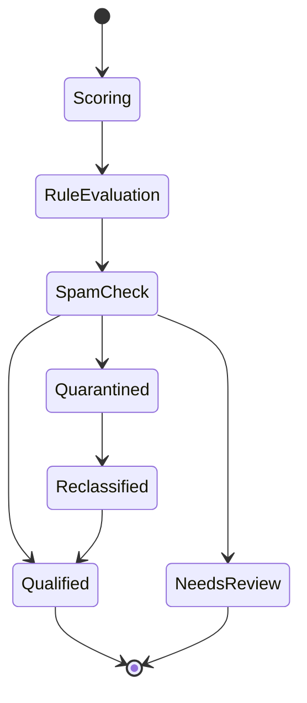
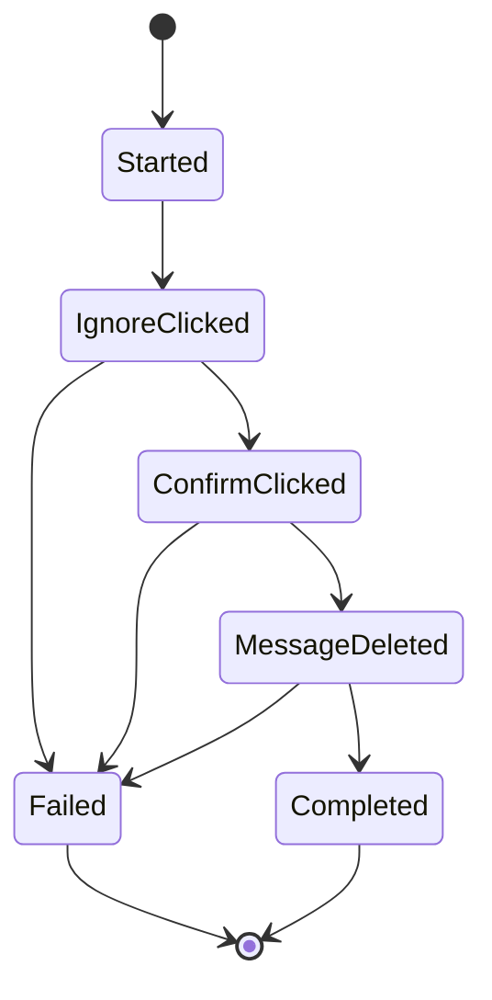

# Technical Design

Companion to the PRD tab. Formalizes the module contracts, state machines and data flow the architecture sections there only sketch.

## Scope and How This Relates to the PRD Tab

The PRD tab defines what to build and why. This tab defines how the pieces fit together at the module level, precise enough that two engineers implementing different components produce compatible code without talking to each other first. It builds on the PRD's Section 14 (Browser Architecture) and Section 12 (Data Model) and does not repeat them.

Nothing here invents a JoyClub selector. The PRD's Section 16.1 still governs: real selectors come from Foundation-phase verification, never from this document.

## Module Contracts

Every cross-context call goes through one typed message envelope, never an ad hoc payload, so a background restart never silently drops an in-flight request.

```
{ type: string, requestId: string, payload: object }
```

Content scripts and the options page send messages to the background through `runtime.sendMessage`; the background replies with the same `requestId` so a caller can match a response to its request even across a background restart. Long-running operations (Quick Ignore and Delete's multi-step sequence) use a `runtime.connect` port instead of a single message, so progress updates stream back and the UI shows exactly where a partial failure happened, feeding `ActionLog`.

| Message type | From, to | Payload | Purpose |
| --- | --- | --- | --- |
| `score.request` | Content script to background | senderId | Compute or fetch a cached Sender Qualification Score |
| `score.result` | Background to content script | senderId, score, criteria | Deliver the score for badge rendering |
| `rule.evaluate` | Content script to background | senderId, snapshot | Run ContactRule evaluation for triage placement |
| `action.ignoreDelete.start` | Content script to background, port | senderId, messageId | Begin the Quick Ignore and Delete sequence |
| `action.ignoreDelete.progress` | Background to content script, port | step, ok | Stream each step's outcome |
| `template.list` | Options or content script to background | none | Fetch the user's MessageTemplate list for the picker |
| `note.save` | Content script or options to background | memberId, body | Persist a UserNote |

Every handler on the background side is a pure function of its stored state plus the message payload. None reads a module-scope variable that could have been reset by a background restart, since the background is non-persistent even on Firefox's event-page model (PRD Section 14.1).

## State Machines

### Triage pipeline



Every transition writes a `ConversationClassification` row recording which rule produced it, per the PRD's Section 7.5 explainability requirement. `Reclassified` exists specifically so an override is itself traceable, not a silent rewrite of the original record.

### Quick Ignore and Delete



Each transition writes one `ActionLog` step immediately, not only at the end, so a browser crash mid-sequence still leaves an accurate record of exactly how far the action got. This is what the PRD's Section 21.2 acceptance criterion, a partial failure always shows a clear notice, actually depends on technically.

One detail the state machine alone does not show: same-tab navigation destroys and recreates the content script instance entirely, so the action state above cannot live in that script's own memory. The background writes a small pending-action marker to `storage.session` before navigating; the content script that loads on the profile page reads that marker on startup to know it is resuming an in-flight sequence, then reports its step back to the background over a fresh port before the tab navigates again. Without this, an engineer building the content-script side could reasonably assume a continuity across the navigation that same-tab navigation does not actually provide.

## Data Access Layer

No component reads or writes IndexedDB or `storage.local` directly. Every read and write goes through one repository module per entity (`ProfileSnapshotRepo`, `UserNoteRepo`, `ActionLogRepo`, and one for each entity in PRD Section 12), each exposing the same four operations: get, list, put, delete. Two reasons this is fixed at design time rather than left to individual judgment:

1. **Encryption boundary.** When sync is on, the repository layer is the one place that knows whether a write also needs the Section 13.4 encryption step before reaching the `SyncConfig` target. A component writing directly to IndexedDB could bypass that boundary by accident.
2. **Schema evolution.** JoyClub's own markup will change (Section 16.6), and this project's own data model will too. A single repository per entity is the one place a migration needs to run, instead of scattered storage calls across every content script and the background.

The repository layer is the only module allowed to import the browser's storage APIs directly. Everything else imports repositories, never storage.

## Reviewer Convergence Check

Two independent passes, each describing components, data model, dependencies and definition of done from reading the PRD tab plus this one, the Task Backlog and the Test Strategy, without reference to how the other was drafting.

**Reviewer A's summary.** Nine runtime components (PRD 14.2), one repository per Section 12 entity behind a single storage boundary, a typed message envelope for every cross-context call. Ten MVP tasks, sequenced against eight Foundation tasks. Definition of done is the PRD's Section 21 plus each task's own acceptance criterion in the Task Backlog.

**Reviewer B's summary.** Broadly the same shape, with two disagreements worth recording rather than glossing over.

1. The Quick Ignore and Delete state machine implied the content script carries state across the profile-page navigation. It cannot: same-tab navigation destroys and recreates that script entirely. Fixed above with a pending-action marker in `storage.session`.
2. Task M9 listed M2, Inbox Triage, as a dependency. It does not need to be one: the button appears on any open message, triaged or not, so the two can be built in parallel. Fixed in the Task Backlog.

**After both fixes, Reviewer A and Reviewer B describe the same system.** One piece of looseness remains: M9's acceptance criterion says "100 percent of test cases" without stating how many test cases make up that check. That is a test-planning detail, not a components, data model or dependency disagreement, and is left as a Foundation-phase decision, once F1 through F7 show how many real messages and failure-injection scenarios are actually worth covering, rather than a number invented here without evidence behind it.

Every artifact across all four tabs is now testable: every MVP task cites an acceptance criterion, every acceptance criterion traces to a PRD section, and the Test Strategy names the test level that verifies it. Nothing found in this pass needs a decision from you; both fixes above were technical corrections, not scope changes.
